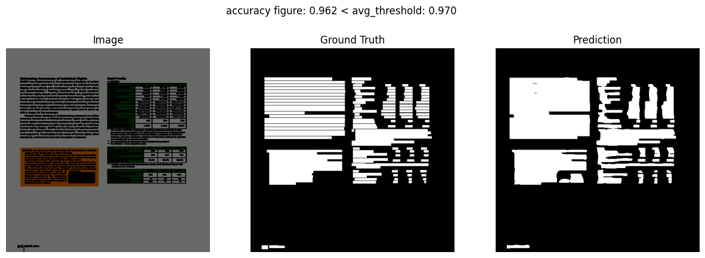
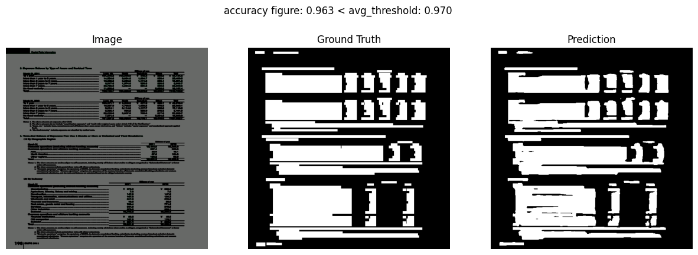
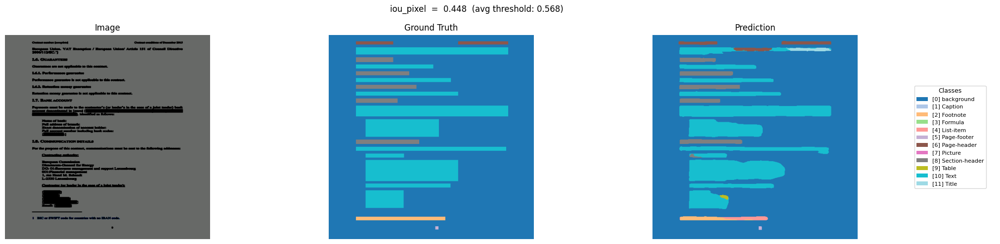
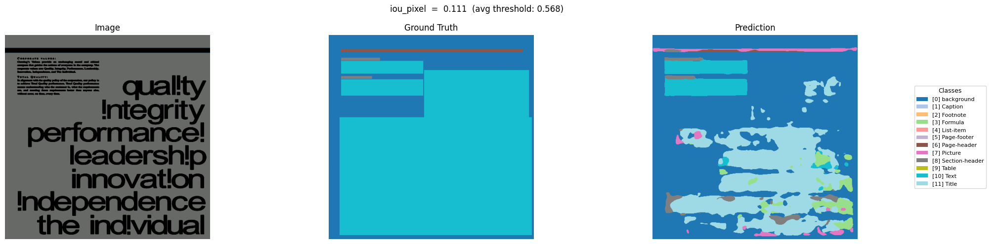
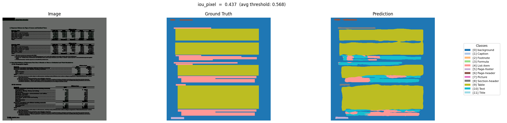
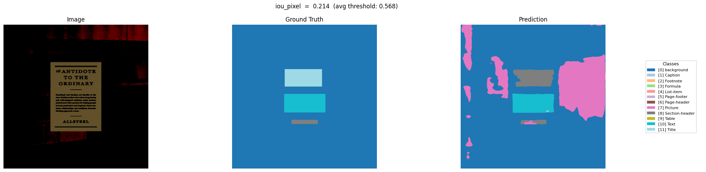
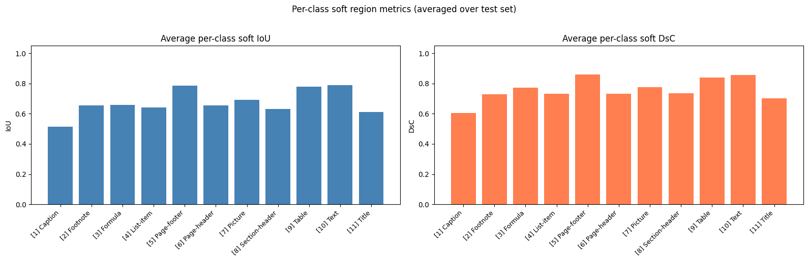

# AAI-590 OCR Master — Document Layout & Text Detection

**Author:** Juan Pablo Triana Martinez  
**Program:** Master of Science in Applied Artificial Intelligence — University of San Diego / Stanford  
**Capstone Project:** AAI-590 Machine Learning Capstone (2023–2026)

---

## Project Overview

This project develops a deep-learning pipeline for **document image understanding** using the [DocLayNet](https://github.com/DS4SD/DocLayNet) dataset. Two complementary segmentation objectives are trained using a **LinkNet + ResNet18** encoder–decoder architecture:

| Objective | Task | Output |
|---|---|---|
| **Binary Text Segmentation** | Detect all text regions in a document page | 1-channel binary mask |
| **Semantic PDF Layout Segmentation** | Classify each pixel into a layout category (Caption, Footnote, Formula, List-item, Page-footer, Page-header, Picture, Section-header, Table, Text, Title) | N-channel class mask |

Both models are trained with a **CombinedLoss** (BCE/CrossEntropy + Dice) and evaluated with pixel-level IoU, Dice, Precision, Recall, F1 and region-level soft IoU / DsC metrics, all tracked live in **TensorBoard**.

---

## Results

### Binary Text Segmentation

The binary model learns to locate every text token on a document page, producing a clean foreground/background mask.

| Sample 1 | Sample 2 |
|:---:|:---:|
|  |  |

---

### Semantic PDF Layout Segmentation

The semantic model classifies document regions into 11 layout categories, enabling full structural understanding of PDF pages.

| Sample 1 | Sample 2 |
|:---:|:---:|
|  |  |

| Sample 3 | Sample 4 |
|:---:|:---:|
|  |  |

Training metrics graph:



---

## Repository Structure

```
AAI-590-OCR-Master/
├── data/                          # DocLayNet subsampled dataset (not tracked in git)
├── docs/                          # Architecture diagrams, result images, model papers
├── notebooks/                     # Exploratory and evaluation Jupyter notebooks
│   ├── Text_Detection_DocLayNet_Model_Unet+ResNet.ipynb   ← Google Colab entry point
│   ├── DocLayNet_evaluate_binary_model.ipynb
│   ├── DocLayNet_evaluate_semantic_segmentation_model.ipynb
│   └── ...
├── scripts/                       # Training entry-point scripts
│   ├── train_binary_text.py
│   └── train_semantic_layout.py
└── src/                           # Python modules (importable package)
    ├── config.py
    ├── data/
    │   ├── dataset.py
    │   └── dataloader.py
    ├── models/
    │   ├── linknet_layers.py
    │   ├── linknet_model.py
    │   ├── ViTSTR_layers.py       ← future work
    │   └── ViTSTR_model.py        ← future work
    ├── training/
    │   ├── loss.py
    │   ├── train.py
    │   └── evaluate.py
    └── utils/
        ├── data_utils.py
        ├── eda_utils.py
        └── text_detection_eval_metrics.py
```

---

## Installation

```bash
git clone https://github.com/juanpajedrez/AAI-590-OCR-Master.git
cd AAI-590-OCR-Master
pip install -r requirements.txt
```

**Key dependencies:** `torch>=2.2`, `torchvision>=0.17`, `tensorboard>=2.16`, `scipy>=1.11`, `tqdm>=4.66`

---

## Google Colab

The notebook **`notebooks/Text_Detection_DocLayNet_Model_Unet+ResNet.ipynb`** is the self-contained entry point designed for **Google Colab** GPU sessions. It handles:

1. Cloning this repository (`main` branch) directly into the Colab runtime
2. Installing dependencies via `pip`
3. Mounting Google Drive for dataset access
4. Running the full binary and semantic training pipelines
5. Evaluating and visualising predictions inline

To use it, open the notebook in Google Colab, connect to a GPU runtime, and run cells top-to-bottom. No local setup is required.

---

## Training Scripts

### Binary Text Segmentation

```bash
# Quickstart with defaults
python scripts/train_binary_text.py

# Custom run
python scripts/train_binary_text.py \
    --dataset_name doclaynet_20_percent_seed_7 \
    --epochs 20 \
    --lr 5e-4 \
    --batch_size 16 \
    --new_height 512 \
    --new_width 512 \
    --weight_ce 1.0 \
    --weight_dice 0.5 \
    --reduction macro \
    --model_name linknet_binary_v2.pth
```

#### `train_binary_text.py` — All Arguments

| Argument | Short | Type | Default | Description |
|---|---|---|---|---|
| `--data_path` | `-dp` | `str` | `./data` | Path to the data folder |
| `--dataset_name` | | `str` | `google_collab_seed_86` | Sub-folder name inside `data_path` |
| `--batch_size` | | `int` | `8` | Samples per batch |
| `--new_height` | | `int` | `512` | Image height after resize |
| `--new_width` | | `int` | `512` | Image width after resize |
| `--num_workers` | | `int` | `0` | DataLoader worker processes |
| `--pin_memory` | | flag | `False` | Enable pinned memory |
| `--jitter_brightness` | | `float` | `0.2` | ColorJitter brightness factor |
| `--jitter_contrast` | | `float` | `0.2` | ColorJitter contrast factor |
| `--jitter_saturation` | | `float` | `0.2` | ColorJitter saturation factor |
| `--jitter_hue` | | `float` | `0.1` | ColorJitter hue factor |
| `--epochs` | | `int` | `5` | Training epochs |
| `--lr` | | `float` | `1e-3` | Adam learning rate |
| `--smooth` | | `float` | `1e-7` | DiceLoss smoothing factor |
| `--weight_ce` | | `float` | `1.0` | BCE loss weight in CombinedLoss |
| `--weight_dice` | | `float` | `0.5` | Dice loss weight in CombinedLoss |
| `--reduction` | | `str` | `macro` | Metric averaging: `macro` or `micro` |
| `--seed` | | `int` | `42` | Random seed |
| `--experiment_name` | | `str` | `DocLayNet_text_detection` | TensorBoard experiment label |
| `--target_dir` | | `str` | `models` | Directory to save model |
| `--model_name` | | `str` | `linknet_binary_text.pth` | Saved model filename (`.pth` or `.pt`) |

---

### Semantic PDF Layout Segmentation

```bash
# Quickstart with defaults
python scripts/train_semantic_layout.py

# Custom run
python scripts/train_semantic_layout.py \
    --dataset_name doclaynet_20_percent_seed_7 \
    --epochs 20 \
    --lr 5e-4 \
    --batch_size 8 \
    --new_height 512 \
    --new_width 512 \
    --weight_ce 1.0 \
    --weight_dice 0.5 \
    --reduction macro \
    --model_name linknet_semantic_v2.pth
```

#### `train_semantic_layout.py` — All Arguments

| Argument | Short | Type | Default | Description |
|---|---|---|---|---|
| `--data_path` | `-dp` | `str` | `./data` | Path to the data folder |
| `--dataset_name` | | `str` | `google_collab_seed_86` | Sub-folder name inside `data_path` |
| `--batch_size` | | `int` | `8` | Samples per batch |
| `--new_height` | | `int` | `512` | Image height after resize |
| `--new_width` | | `int` | `512` | Image width after resize |
| `--num_workers` | | `int` | `0` | DataLoader worker processes |
| `--pin_memory` | | flag | `False` | Enable pinned memory |
| `--jitter_brightness` | | `float` | `0.2` | ColorJitter brightness factor |
| `--jitter_contrast` | | `float` | `0.2` | ColorJitter contrast factor |
| `--jitter_saturation` | | `float` | `0.2` | ColorJitter saturation factor |
| `--jitter_hue` | | `float` | `0.1` | ColorJitter hue factor |
| `--epochs` | | `int` | `5` | Training epochs |
| `--lr` | | `float` | `1e-3` | Adam learning rate |
| `--smooth` | | `float` | `1e-7` | DiceLoss smoothing factor |
| `--weight_ce` | | `float` | `1.0` | CrossEntropy loss weight in CombinedLoss |
| `--weight_dice` | | `float` | `0.5` | Dice loss weight in CombinedLoss |
| `--reduction` | | `str` | `macro` | Metric averaging: `macro` or `micro` |
| `--no_ignore_background` | | flag | `False` | Include background class (0) in loss & metrics |
| `--seed` | | `int` | `42` | Random seed |
| `--experiment_name` | | `str` | `DocLayNet_text_detection` | TensorBoard experiment label |
| `--target_dir` | | `str` | `models` | Directory to save model |
| `--model_name` | | `str` | `linknet_semantic_layout.pth` | Saved model filename (`.pth` or `.pt`) |

---

### Monitoring with TensorBoard

After a training run, launch TensorBoard from the project root:

```bash
tensorboard --logdir runs/
```

Then open `http://localhost:6006` in your browser. All loss curves, per-epoch metrics, model graph, and hyperparameter sweeps are logged automatically.

---

## Source Modules (`src/`)

### `src/data/`

| Module | Description |
|---|---|
| `dataset.py` | `TextDetectionDataset` — a PyTorch `Dataset` that reads the DocLayNet COCO annotations and constructs pixel-accurate masks on-the-fly. Supports `"binary-text"` (1-channel float mask from the `JSON/` extra files) and `"semantic-layout"` (long-integer class-index mask from COCO annotations). Handles bbox scaling correctly when images are resized. |
| `dataloader.py` | `get_dataloaders_text_detection()` — builds train / val / test `DataLoader`s. When transforms are not provided it automatically computes per-channel mean and std from the training split (no data leakage) and creates a `ColorJitter + Normalize` training transform and a clean inference transform for val/test. |

### `src/models/`

| Module | Description |
|---|---|
| `linknet_layers.py` | Individual building blocks for the LinkNet architecture: `LinknetStem`, `LinknetEncoderBlock`, `LinknetDecoderBlock`, `LinknetReconstructer`. Each block is implemented as an `nn.Module` with ResNet18-style residual connections. |
| `linknet_model.py` | `LinknetModel` — the full encoder–decoder model. Takes `Cin` input channels (3 for RGB) and outputs `N` channels (`N=1` for binary, `N=num_classes` for semantic). |
| `ViTSTR_layers.py` | *(Future work)* Layer definitions for the Vision Transformer Scene Text Recognizer. |
| `ViTSTR_model.py` | *(Future work)* Full ViTSTR model for text recognition (OCR stage 2). See section below. |

### `src/training/`

| Module | Description |
|---|---|
| `loss.py` | `DiceLoss` — soft Dice loss for binary and multi-class segmentation. `CombinedLoss` — weighted sum of BCE/CrossEntropy and Dice, configurable per task. |
| `train.py` | `train_step()` / `test_step()` — single-epoch train and eval loops. `train()` — full multi-epoch loop with TensorBoard logging of all metrics. `create_writer()` — creates a timestamped `SummaryWriter`. `add_hparams_to_writer()` — logs hyperparameters to TensorBoard's HParams tab. `save_model()` — saves model `state_dict` to disk. |
| `evaluate.py` | *(Reserved)* Standalone evaluation utilities for running inference on saved checkpoints. |

### `src/utils/`

| Module | Description |
|---|---|
| `text_detection_eval_metrics.py` | All metric functions: `get_binary_metrics()` (pixel-level accuracy, precision, recall, F1, IoU, Dice for binary tasks), `get_semantic_metrics()` (macro/micro multi-class IoU and Dice), `get_soft_metrics()` (region-level soft IoU and DsC via `binary_soft_metrics` / `multiclass_soft_metrics`). |
| `data_utils.py` | `download_raw_data()` — streams DocLayNet zip files with progress bars. `extract_raw_data()` — extracts zip archives. `ObtainSubSample` — class that creates a reproducible stratified subsample from the full DocLayNet dataset (reads COCO JSONs, samples by seed, extracts matching PNGs/JSONs/PDFs, writes metadata). `compute_train_mean_std()` — memory-efficient single-pass computation of per-channel mean and std from the training split. |
| `eda_utils.py` | `MetadataRetriever` — loads COCO split files and exposes helpers for exploratory data analysis (category distributions, image statistics). |

---

## Notebooks

| Notebook | Purpose |
|---|---|
| `Text_Detection_DocLayNet_Model_Unet+ResNet.ipynb` | **Google Colab entry point.** Clones this repo, installs deps, mounts Drive, trains both models end-to-end. |
| `DocLayNet_download_data.ipynb` | Downloads and subsamples the DocLayNet dataset using `ObtainSubSample`. |
| `DocLayNet_eda.ipynb` | Exploratory data analysis — category distributions, annotation statistics, sample visualisations. |
| `DocLayNet_TextDetectDataset.ipynb` | Unit-tests the `TextDetectionDataset` class and visualises generated masks. |
| `DocLayNet_linknet_arch.ipynb` | Visualises the LinkNet model graph and layer shapes using `torchinfo`. |
| `DocLayNet_train_text_detection.ipynb` | Interactive training notebook (local GPU). |
| `DocLayNet_evaluate_binary_model.ipynb` | Loads a saved binary checkpoint and runs full evaluation on the test split. |
| `DocLayNet_evaluate_semantic_segmentation_model.ipynb` | Loads a saved semantic checkpoint and runs full evaluation on the test split. |
| `DocLayNet_eval_text_detection_metrics.ipynb` / `_v2.ipynb` | Metric validation and debugging notebooks. |

---

## Architecture

The model is a **LinkNet** encoder–decoder with a **ResNet18** backbone:

| Component | Details |
|---|---|
| Stem | 7×7 conv, stride 2, BN, ReLU → MaxPool |
| Encoder | 4× residual encoder blocks (64 → 128 → 256 → 512 channels) |
| Decoder | 4× transposed-conv decoder blocks with skip connections (512 → 256 → 128 → 64) |
| Reconstructer | Two deconv layers → 1×1 conv → `N` output channels |

Architecture reference diagrams are in `docs/linknet_resnet18_*.png`.

---

## Future Work — ViTSTR Text Recognition

The `src/models/ViTSTR_layers.py` and `src/models/ViTSTR_model.py` files are scaffolded for a second pipeline stage: **text recognition** using a Vision Transformer Scene Text Recognizer (ViTSTR).

The intended pipeline is:
1. **Detection** (this project) — LinkNet segments text regions or layout blocks
2. **Recognition** (future) — ViTSTR reads character sequences from each cropped region

This work is planned for after the Master's completion. The ViTSTR paper is included in `docs/model_papers/ViTSTR_paper.pdf` for reference.

---

## References

Papers in `docs/model_papers/`:
- **LinkNet** — *LinkNet: Exploiting Encoder Representations for Efficient Semantic Segmentation*
- **U-Net** — *U-Net: Convolutional Networks for Biomedical Image Segmentation*
- **DBResNet** — *Real-time Scene Text Detection with Differentiable Binarization*
- **DocParseNet** — *DocParseNet: Document Layout Parsing with Deep Learning*
- **ViTSTR** — *Vision Transformer for Fast and Efficient Scene Text Recognition*
- **DocLayNet** — IBM Research dataset for document layout analysis
