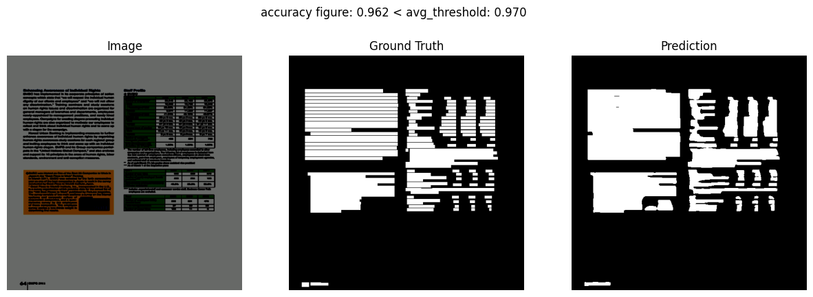
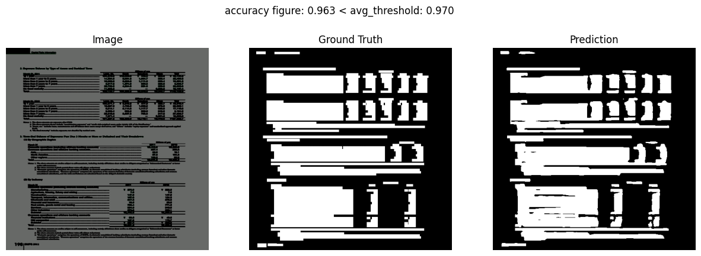
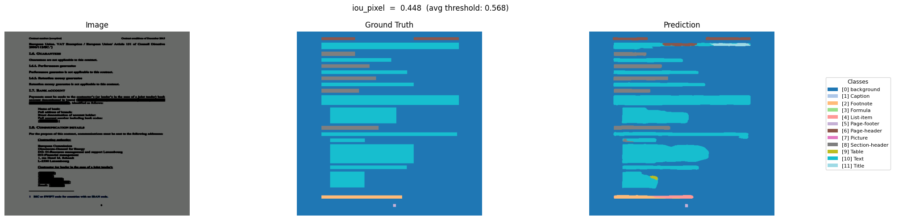
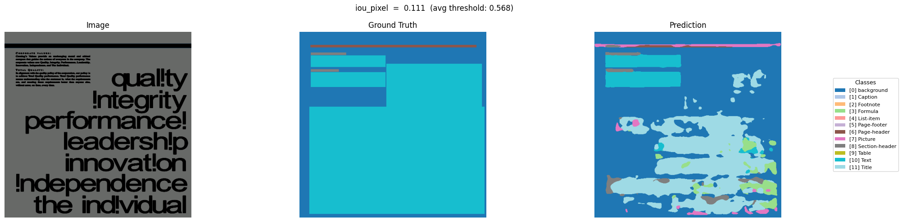
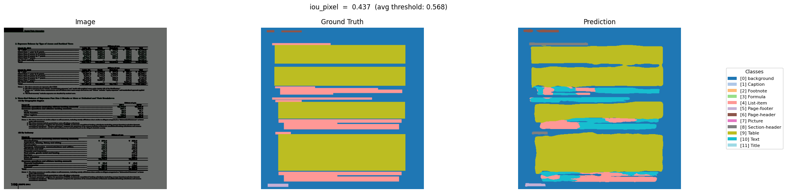
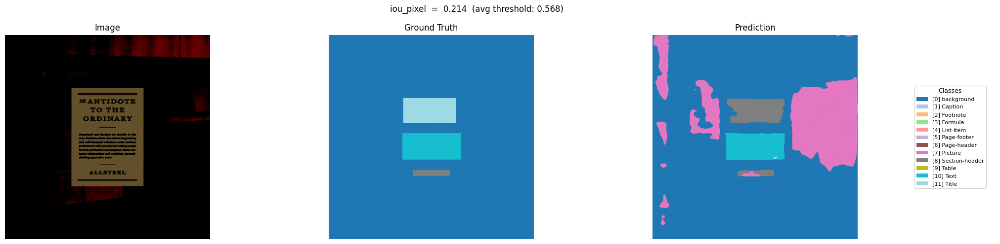
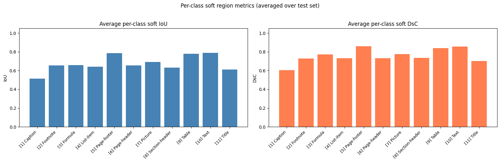

# AAI-590 OCR Master — Document Layout & Text Detection

* **Author:** Juan Pablo Triana Martinez  
* **Program:** Master of Science in Applied Artificial Intelligence — University of San Diego
* **Capstone Project:** AAI-590 Machine Learning Capstone (2023–2026)

---

## Project Overview

This project develops a deep-learning pipeline for **document image understanding** using the [DocLayNet](https://github.com/DS4SD/DocLayNet) dataset. Two complementary segmentation objectives are trained and benchmarked across **seven from-scratch encoder–decoder architectures**:

| Objective | Task | Output |
|---|---|---|
| **Binary Text Segmentation** | Detect all text regions in a document page | 1-channel binary mask |
| **Semantic PDF Layout Segmentation** | Classify each pixel into a layout category (Caption, Footnote, Formula, List-item, Page-footer, Page-header, Picture, Section-header, Table, Text, Title) | N-channel class mask |

Every model is trained with a selectable loss (**Dice**, **BCE / CrossEntropy**, or a weighted **CombinedLoss**) and evaluated with pixel-level IoU, Dice, Precision, Recall, F1 and region-level soft IoU / DsC metrics, all tracked live in **TensorBoard**. After training, each run is automatically profiled for **parameter count, FLOPs, inference latency, throughput, peak memory and training time**, producing the efficiency benchmarks used in the accompanying IEEE paper.

---

## Model Zoo

All architectures are implemented from scratch in `src/models/` and share the same constructor signature `(Cin, N)`, mapping `(B, Cin, H, W) → (B, N, H, W)`. They are selected at training time with the `--arch` flag.

| `--arch` | Architecture | Backbone | ~Params | Reference |
|---|---|---|---|---|
| `linknet-resnet` *(default)* | LinkNet | ResNet18-style | 11.5M | [LinkNet](https://arxiv.org/abs/1707.03718) |
| `unet-resnet18` | U-Net | ResNet18 | 14.3M | [U-Net](https://arxiv.org/abs/1505.04597) |
| `fpn-resnet18` | Feature Pyramid Network (Panoptic-FPN head) | ResNet18 | 13.1M | [FPN](https://arxiv.org/abs/1612.03144), [Panoptic FPN](https://arxiv.org/abs/1901.02446) |
| `bisenet-resnet18` | BiSeNet V1 (Spatial + Context paths, ARM, FFM) | ResNet18 | 13.2M | [BiSeNet](https://arxiv.org/abs/1808.00897) |
| `swiftnet-resnet18` | SwiftNet (SPP bottleneck, slim 128-ch decoder) | ResNet18 | 11.8M | [SwiftNet](https://arxiv.org/abs/1903.08469) |
| `deeplabv3-mobilenetv2` | DeepLabV3 (dilated OS16 + ASPP) | MobileNetV2 | 5.1M | [DeepLabV3](https://arxiv.org/abs/1706.05587), [MobileNetV2](https://arxiv.org/abs/1801.04381) |
| `unet-mobilenetv2` | U-Net | MobileNetV2 | 6.6M | [U-Net](https://arxiv.org/abs/1505.04597), [MobileNetV2](https://arxiv.org/abs/1801.04381) |

The ResNet18 and MobileNetV2 encoders live in `src/models/backbones.py` and are shared by every non-LinkNet model. Each architecture has a dedicated walkthrough notebook (see [Notebooks](#notebooks)).

---

## Results

### Binary Text Segmentation

The binary model learns to locate every text token on a document page, producing a clean foreground/background mask.

| Sample 1 | Sample 2 |
|:---:|:---:|
|  |  |

---

### Semantic PDF Layout Segmentation

The semantic model classifies document regions into 11 layout categories, enabling full structural understanding of PDF pages.

| Sample 1 | Sample 2 |
|:---:|:---:|
|  |  |

| Sample 3 | Sample 4 |
|:---:|:---:|
|  |  |

Training metrics graph:



---

## Repository Structure

```
AAI-590-OCR-Master/
├── data/                          # DocLayNet raw zips + subsampled datasets (not tracked in git)
├── demos/                         # Self-contained Gradio apps for HuggingFace Spaces (not tracked in git)
│   ├── binary_text_segmentation/  #   app.py, model.py, requirements.txt, checkpoint, examples/
│   └── semantic_text_segmentation/
├── docs/                          # Architecture diagrams, result images, model papers, conda env
├── examples/                      # Sample document images + ground-truth masks used by the demos
├── experiments/
│   └── benchmarks/                # JSON efficiency reports written after every training run
├── models/                        # Saved .pth checkpoints (not tracked in git)
├── runs/                          # TensorBoard logs (not tracked in git)
├── notebooks/                     # Exploratory, architecture, evaluation and deployment notebooks
│   ├── Text_Detection_DocLayNet_Model_Unet+ResNet.ipynb   ← Google Colab entry point
│   ├── DocLayNet_*_arch.ipynb                             ← one per architecture
│   ├── DocLayNet_evaluate_*_model.ipynb
│   ├── Gradio_*_demo.ipynb / Deploy_*_HuggingFace.ipynb
│   └── ...
├── scripts/                       # Command-line entry points
│   ├── download_zip_files.py      #   1. download / extract DocLayNet zips
│   ├── get_subsample.py           #   2. build a reproducible subsample
│   ├── train_binary_text.py       #   3a. train + benchmark a binary model
│   └── train_semantic_layout.py   #   3b. train + benchmark a semantic model
└── src/                           # Python modules (importable package)
    ├── config.py
    ├── data/
    │   ├── dataset.py
    │   └── dataloader.py
    ├── models/
    │   ├── backbones.py           # ResNet18Encoder, MobileNetV2Encoder, shared blocks
    │   ├── linknet_layers.py
    │   ├── linknet_model.py
    │   ├── unet_models.py         # UNetResNet18Model, UNetMobileNetV2Model
    │   ├── fpn_resnet18.py
    │   ├── bisenet_resnet18.py
    │   ├── swiftnet_resnet18.py
    │   ├── deeplabv3_mobilenetv2.py
    │   └── model_factory.py       # ARCH_REGISTRY / build_model()
    ├── training/
    │   ├── loss.py
    │   ├── train.py
    │   └── evaluate.py
    └── utils/
        ├── benchmark.py           # params, FLOPs, latency, memory, JSON reports
        ├── data_utils.py
        ├── eda_utils.py
        └── text_detection_eval_metrics.py
```

---

## Installation

```bash
git clone https://github.com/juanpajedrez/AAI-590-OCR-Master.git
cd AAI-590-OCR-Master
pip install -r requirements.txt

# Optional: linting / testing tools
pip install -r requirements-dev.txt
```

**Key dependencies:** `torch>=2.2`, `torchvision>=0.17`, `torchinfo>=1.8`, `tensorboard>=2.16`, `scipy>=1.11`, `tqdm>=4.66`, `gradio`, `psutil>=5.9`

A conda environment specification is also available at `docs/python-env.yml`.

---

## Google Colab

The notebook **`notebooks/Text_Detection_DocLayNet_Model_Unet+ResNet.ipynb`** is the self-contained entry point designed for **Google Colab** GPU sessions. It handles:

1. Cloning this repository (`main` branch) directly into the Colab runtime
2. Installing dependencies via `pip`
3. Mounting Google Drive for dataset access
4. Selecting an architecture through a single `ARCH` variable
5. Running the binary and semantic training pipelines (with automatic efficiency benchmarking)
6. Evaluating and visualising predictions inline

To use it, open the notebook in Google Colab, connect to a GPU runtime, set `ARCH` to any value from the [Model Zoo](#model-zoo), and run cells top-to-bottom. No local setup is required.

---

## Data Preparation

### 1. Download DocLayNet

`scripts/download_zip_files.py` streams `DocLayNet_core.zip` and `DocLayNet_extra.zip` from IBM's object storage into `data/raw/` with progress bars, and can optionally extract them.

```bash
# Download both archives (default)
python scripts/download_zip_files.py

# Download and extract everything
python scripts/download_zip_files.py --core_extract True --extra_extract True
```

| Argument | Short | Type | Default | Description |
|---|---|---|---|---|
| `--core_download` | `-crd` | `bool` | `True` | Download `DocLayNet_core.zip` |
| `--extra_download` | `-exd` | `bool` | `True` | Download `DocLayNet_extra.zip` |
| `--core_extract` | `-cre` | `bool` | `False` | Extract the full core archive |
| `--extra_extract` | `-exe` | `bool` | `False` | Extract the full extra archive |

### 2. Build a Subsample

`scripts/get_subsample.py` reads the COCO split files inside the zips and writes a reproducible, seeded subsample (PNGs, JSONs, PDFs and metadata) to `data/<subsample_name>/` without extracting the full 28 GB dataset.

```bash
# Default: 1000 train / 250 val / 100 test, seed 42
python scripts/get_subsample.py

# Custom subsample
python scripts/get_subsample.py \
    --subsample_name doclaynet_20_percent_seed_7 \
    --n_samples_train 13000 \
    --n_samples_val 1300 \
    --n_samples_test 1000 \
    --seed 7
```

| Argument | Short | Type | Default | Description |
|---|---|---|---|---|
| `--n_samples_train` | | `int` | `1000` | Training images to sample |
| `--n_samples_val` | | `int` | `250` | Validation images to sample |
| `--n_samples_test` | | `int` | `100` | Test images to sample |
| `--subsample_name` | | `str` | `test_subsample` | Output folder name inside `data_path` |
| `--seed` | | `int` | `42` | Random seed for sampling |
| `--extra` | | `bool` | `True` | Also pull matching files from `DocLayNet_extra.zip` (needed for binary text masks) |
| `--data_path` | `-dp` | `str` | `./data` | Data folder path |
| `--zip_core_path` | | `str` | `./data/raw/DocLayNet_core.zip` | Path to the core archive |
| `--zip_extra_path` | | `str` | `./data/raw/DocLayNet_extra.zip` | Path to the extra archive |

---

## Training Scripts

Both training scripts share the same workflow:

1. Build train / val / test dataloaders (training mean/std computed automatically)
2. Instantiate the architecture chosen with `--arch` via `build_model()`
3. Train with the loss chosen by `--loss_fn`, logging every metric to TensorBoard
4. Run the efficiency benchmark (params, FLOPs, latency, FPS, peak memory, training time) and save it as JSON under `--benchmark_dir`
5. Log hyperparameters to TensorBoard's HParams tab and save the checkpoint to `--target_dir`

### Binary Text Segmentation

```bash
# Quickstart with defaults (LinkNet, combined loss)
python scripts/train_binary_text.py

# Train a different architecture
python scripts/train_binary_text.py --arch unet-resnet18
python scripts/train_binary_text.py --arch deeplabv3-mobilenetv2

# Loss ablations
python scripts/train_binary_text.py --loss_fn dice --smooth 1e-7
python scripts/train_binary_text.py --loss_fn cross-entropy

# Custom run
python scripts/train_binary_text.py \
    --arch fpn-resnet18 \
    --dataset_name doclaynet_20_percent_seed_7 \
    --epochs 20 \
    --lr 5e-4 \
    --batch_size 16 \
    --new_height 512 \
    --new_width 512 \
    --weight_ce 1.0 \
    --weight_dice 0.5 \
    --reduction macro \
    --model_name fpn_binary_v2.pth
```

#### `train_binary_text.py` — All Arguments

| Argument | Short | Type | Default | Description |
|---|---|---|---|---|
| `--arch` | | `str` | `linknet-resnet` | Architecture to train (see [Model Zoo](#model-zoo)) |
| `--data_path` | `-dp` | `str` | `./data` | Path to the data folder |
| `--dataset_name` | | `str` | `google_collab_seed_86` | Sub-folder name inside `data_path` |
| `--batch_size` | | `int` | `8` | Samples per batch |
| `--new_height` | | `int` | `512` | Image height after resize |
| `--new_width` | | `int` | `512` | Image width after resize |
| `--num_workers` | | `int` | `0` | DataLoader worker processes |
| `--pin_memory` | | flag | `False` | Enable pinned memory |
| `--jitter_brightness` | | `float` | `0.2` | ColorJitter brightness factor |
| `--jitter_contrast` | | `float` | `0.2` | ColorJitter contrast factor |
| `--jitter_saturation` | | `float` | `0.2` | ColorJitter saturation factor |
| `--jitter_hue` | | `float` | `0.1` | ColorJitter hue factor |
| `--epochs` | | `int` | `5` | Training epochs |
| `--lr` | | `float` | `1e-3` | Adam learning rate |
| `--loss_fn` | | `str` | `combined` | Loss function: `dice`, `cross-entropy` (BCE) or `combined` (BCE + Dice) |
| `--smooth` | | `float` | `1e-7` | DiceLoss smoothing factor (`dice`, `combined`) |
| `--weight_ce` | | `float` | `1.0` | BCE loss weight in CombinedLoss (`combined` only) |
| `--weight_dice` | | `float` | `0.5` | Dice loss weight in CombinedLoss (`combined` only) |
| `--reduction` | | `str` | `macro` | Metric averaging: `macro` or `micro` |
| `--seed` | | `int` | `42` | Random seed |
| `--experiment_name` | | `str` | `DocLayNet_text_detection` | TensorBoard experiment label |
| `--target_dir` | | `str` | `models` | Directory to save model |
| `--model_name` | | `str` | `<arch>_binary_text.pth` | Saved model filename (`.pth` or `.pt`) |
| `--benchmark_dir` | | `str` | `experiments/benchmarks` | Directory for the benchmark JSON report |

---

### Semantic PDF Layout Segmentation

The number of output classes is resolved automatically from the dataset's COCO metadata (11 DocLayNet categories + background).

```bash
# Quickstart with defaults (LinkNet, combined loss)
python scripts/train_semantic_layout.py

# Train a different architecture
python scripts/train_semantic_layout.py --arch bisenet-resnet18
python scripts/train_semantic_layout.py --arch swiftnet-resnet18

# Include the background class in loss and metrics
python scripts/train_semantic_layout.py --no_ignore_background

# Custom run
python scripts/train_semantic_layout.py \
    --arch unet-mobilenetv2 \
    --dataset_name doclaynet_20_percent_seed_7 \
    --epochs 20 \
    --lr 5e-4 \
    --batch_size 8 \
    --new_height 512 \
    --new_width 512 \
    --weight_ce 1.0 \
    --weight_dice 0.5 \
    --reduction macro \
    --model_name unet_mobilenetv2_semantic_v2.pth
```

#### `train_semantic_layout.py` — All Arguments

| Argument | Short | Type | Default | Description |
|---|---|---|---|---|
| `--arch` | | `str` | `linknet-resnet` | Architecture to train (see [Model Zoo](#model-zoo)) |
| `--data_path` | `-dp` | `str` | `./data` | Path to the data folder |
| `--dataset_name` | | `str` | `google_collab_seed_86` | Sub-folder name inside `data_path` |
| `--batch_size` | | `int` | `8` | Samples per batch |
| `--new_height` | | `int` | `512` | Image height after resize |
| `--new_width` | | `int` | `512` | Image width after resize |
| `--num_workers` | | `int` | `0` | DataLoader worker processes |
| `--pin_memory` | | flag | `False` | Enable pinned memory |
| `--jitter_brightness` | | `float` | `0.2` | ColorJitter brightness factor |
| `--jitter_contrast` | | `float` | `0.2` | ColorJitter contrast factor |
| `--jitter_saturation` | | `float` | `0.2` | ColorJitter saturation factor |
| `--jitter_hue` | | `float` | `0.1` | ColorJitter hue factor |
| `--epochs` | | `int` | `5` | Training epochs |
| `--lr` | | `float` | `1e-3` | Adam learning rate |
| `--loss_fn` | | `str` | `combined` | Loss function: `dice`, `cross-entropy` or `combined` (CE + Dice) |
| `--smooth` | | `float` | `1e-7` | DiceLoss smoothing factor (`dice`, `combined`) |
| `--weight_ce` | | `float` | `1.0` | CrossEntropy loss weight in CombinedLoss (`combined` only) |
| `--weight_dice` | | `float` | `0.5` | Dice loss weight in CombinedLoss (`combined` only) |
| `--reduction` | | `str` | `macro` | Metric averaging: `macro` or `micro` |
| `--no_ignore_background` | | flag | `False` | Include background class (0) in loss & metrics |
| `--seed` | | `int` | `42` | Random seed |
| `--experiment_name` | | `str` | `DocLayNet_text_detection` | TensorBoard experiment label |
| `--target_dir` | | `str` | `models` | Directory to save model |
| `--model_name` | | `str` | `<arch>_semantic_layout.pth` | Saved model filename (`.pth` or `.pt`) |
| `--benchmark_dir` | | `str` | `experiments/benchmarks` | Directory for the benchmark JSON report |

---

### Efficiency Benchmarks

Every training run finishes by calling `benchmark_model()` from `src/utils/benchmark.py` on the trained network and writing a JSON report to `experiments/benchmarks/<arch>_<task>_<loss_fn>.json`. Each report contains:

| Field | Description |
|---|---|
| `total_params`, `trainable_params`, `params_million` | Parameter counts |
| `flops`, `gflops` | Forward-pass FLOPs for one `(1, 3, H, W)` image via `torch.profiler` (falls back to `thop` if installed) |
| `latency_ms_mean`, `latency_ms_std`, `fps` | Single-image inference latency and throughput (50 timed iterations after 10 warm-up passes, CUDA-synchronised on GPU) |
| `peak_memory_mb`, `memory_type` | Peak CUDA memory allocated, or process RSS delta on CPU (`psutil`) |
| `training_time_s`, `training_time_per_epoch_s` | Wall-clock training time |

The same utilities can be used standalone, e.g. to compare untrained architectures:

```python
from src.models import build_model
from src.utils import benchmark_model, print_benchmark

model = build_model(arch="swiftnet-resnet18", Cin=3, N=12)
report = benchmark_model(model, input_size=(1, 3, 512, 512), device="cuda", arch_name="swiftnet-resnet18")
print_benchmark(report)
```

---

### Monitoring with TensorBoard

After a training run, launch TensorBoard from the project root:

```bash
tensorboard --logdir runs/
```

Then open `http://localhost:6006` in your browser. Runs are grouped as `runs/<date>/<experiment_name>/<arch>/<task>_<loss_fn>/`, so every architecture and loss ablation can be compared side by side. All loss curves, per-epoch metrics, model graph, and hyperparameter sweeps are logged automatically.

---

## Live Demos (Gradio / HuggingFace Spaces)

Two interactive **Gradio** applications showcase the trained LinkNet checkpoints. Each demo accepts a document image, resizes and normalises it with the training statistics, and overlays the predicted mask.

| Demo | Notebook to build it | Output folder |
|---|---|---|
| Binary text segmentation | `notebooks/Deploy_Binary_Text_Segmentation_HuggingFace.ipynb` | `demos/binary_text_segmentation/` |
| Semantic PDF layout segmentation | `notebooks/Deploy_Semantic_Text_Segmentation_HuggingFace.ipynb` | `demos/semantic_text_segmentation/` |

The deploy notebooks assemble a **self-contained** folder (`app.py`, `model.py`, `requirements.txt`, the `.pth` checkpoint and an `examples/` directory) that can be uploaded directly to a HuggingFace Space. The `Gradio_*_demo.ipynb` notebooks walk through building the same interface step by step inside Jupyter. Sample images and ground-truth masks used by the demos live in `examples/`.

To run a demo locally:

```bash
cd demos/binary_text_segmentation
pip install -r requirements.txt
python app.py
```

---

## Source Modules (`src/`)

### `src/data/`

| Module | Description |
|---|---|
| `dataset.py` | `TextDetectionDataset` — a PyTorch `Dataset` that reads the DocLayNet COCO annotations and constructs pixel-accurate masks on-the-fly. Supports `"binary-text"` (1-channel float mask from the `JSON/` extra files) and `"semantic-layout"` (long-integer class-index mask from COCO annotations). Handles bbox scaling correctly when images are resized. |
| `dataloader.py` | `get_dataloaders_text_detection()` — builds train / val / test `DataLoader`s. When transforms are not provided it automatically computes per-channel mean and std from the training split (no data leakage) and creates a `ColorJitter + Normalize` training transform and a clean inference transform for val/test. |

### `src/models/`

| Module | Description |
|---|---|
| `model_factory.py` | `ARCH_REGISTRY` (name → class), `ARCH_CHOICES` and `build_model(arch, Cin, N)` — the single entry point used by the training scripts and notebooks to instantiate any architecture by name. |
| `backbones.py` | Shared from-scratch encoders and blocks: `ConvBNReLU`, `ResNetBasicBlock`, `ResNet18Encoder`, `InvertedResidual`, `MobileNetV2Encoder`. Both encoders return five multi-scale feature maps at 1/2, 1/4, 1/8, 1/16 and 1/32 resolution. |
| `linknet_layers.py` | LinkNet building blocks: `LinknetStem`, `LinknetEncoderBlock`, `LinknetDecoderBlock`, `LinknetReconstructer`, each with ResNet18-style residual connections. |
| `linknet_model.py` | `LinknetModel` — the original LinkNet encoder–decoder (`linknet-resnet`). |
| `unet_models.py` | `UNetDecoderBlock`, `UNetDecoder`, `UNetResNet18Model` (`unet-resnet18`) and `UNetMobileNetV2Model` (`unet-mobilenetv2`) — bilinear 2× upsampling with skip concatenation and double 3×3 convolutions. |
| `fpn_resnet18.py` | `FPNLateralBlock`, `FPNSegmentationBlock`, `FPNResNet18Model` (`fpn-resnet18`) — top-down pyramid with lateral 1×1 convolutions and a Panoptic-FPN style segmentation branch. |
| `bisenet_resnet18.py` | `SpatialPath`, `AttentionRefinementModule`, `FeatureFusionModule`, `BiSeNetResNet18Model` (`bisenet-resnet18`) — bilateral spatial/context paths fused at 1/8 resolution. |
| `swiftnet_resnet18.py` | `SpatialPyramidPooling`, `SwiftNetUpsampleBlock`, `SwiftNetResNet18Model` (`swiftnet-resnet18`) — real-time single-scale model with an SPP bottleneck and slim 128-channel decoder. |
| `deeplabv3_mobilenetv2.py` | `ASPP`, `DeepLabV3MobileNetV2Model` (`deeplabv3-mobilenetv2`) — dilated MobileNetV2 at output stride 16 followed by Atrous Spatial Pyramid Pooling. |

### `src/training/`

| Module | Description |
|---|---|
| `loss.py` | `DiceLoss` — soft Dice loss for binary and multi-class segmentation. `SegCrossEntropyLoss` — BCEWithLogits (binary) / CrossEntropy (multi-class) behind a single signature. `CombinedLoss` — weighted sum of BCE/CrossEntropy and Dice, configurable per task. `get_loss_fn()` — factory that builds any of the three from the `--loss_fn` CLI flag (`LOSS_FN_CHOICES`). |
| `train.py` | `train_step()` / `test_step()` — single-epoch train and eval loops. `train()` — full multi-epoch loop with TensorBoard logging of all metrics. `create_writer()` — creates a timestamped `SummaryWriter`. `add_hparams_to_writer()` — logs hyperparameters to TensorBoard's HParams tab. `save_model()` — saves model `state_dict` to disk. |
| `evaluate.py` | *(Reserved)* Standalone evaluation utilities for running inference on saved checkpoints. |

### `src/utils/`

| Module | Description |
|---|---|
| `benchmark.py` | `count_parameters()`, `measure_flops()`, `measure_inference_speed()`, `measure_memory()`, `benchmark_model()` (combines all of the above plus training time into one report dict), `print_benchmark()` and `save_benchmark()` (writes the report as JSON). |
| `text_detection_eval_metrics.py` | All metric functions: `get_binary_metrics()` (pixel-level accuracy, precision, recall, F1, IoU, Dice for binary tasks), `get_semantic_metrics()` (macro/micro multi-class IoU and Dice), `get_soft_metrics()` (region-level soft IoU and DsC via `binary_soft_metrics` / `multiclass_soft_metrics`). |
| `data_utils.py` | `download_raw_data()` — streams DocLayNet zip files with progress bars. `extract_raw_data()` — extracts zip archives. `ObtainSubSample` — class that creates a reproducible stratified subsample from the full DocLayNet dataset (reads COCO JSONs, samples by seed, extracts matching PNGs/JSONs/PDFs, writes metadata). `compute_train_mean_std()` — memory-efficient single-pass computation of per-channel mean and std from the training split. |
| `eda_utils.py` | `MetadataRetriever` — loads COCO split files and exposes helpers for exploratory data analysis (category distributions, supercategories, image statistics). Also used by the semantic training script to resolve the number of classes. |

---

## Notebooks

### Pipeline & Data

| Notebook | Purpose |
|---|---|
| `Text_Detection_DocLayNet_Model_Unet+ResNet.ipynb` | **Google Colab entry point.** Clones this repo, installs deps, mounts Drive, trains and benchmarks any architecture end-to-end via the `ARCH` variable. |
| `DocLayNet_download_data.ipynb` | Downloads and subsamples the DocLayNet dataset using `ObtainSubSample`. |
| `DocLayNet_eda.ipynb` | Exploratory data analysis — category distributions, annotation statistics, sample visualisations. |
| `DocLayNet_TextDetectDataset.ipynb` | Unit-tests the `TextDetectionDataset` class and visualises generated masks. |
| `DocLayNet_train_text_detection.ipynb` | Interactive training notebook (local GPU). |

### Architecture Walkthroughs

Each notebook rebuilds one architecture layer by layer with `torch.nn`, explains every block, and prints `torchinfo` summaries and shape traces for a `(B, 3, 512, 512)` input.

| Notebook | Architecture |
|---|---|
| `DocLayNet_linknet_arch.ipynb` | LinkNet + ResNet18-style encoder (`linknet-resnet`) |
| `DocLayNet_unet_resnet18_arch.ipynb` | U-Net + ResNet18 (`unet-resnet18`) |
| `DocLayNet_fpn_resnet18_arch.ipynb` | FPN + ResNet18 (`fpn-resnet18`) |
| `DocLayNet_bisenet_resnet18_arch.ipynb` | BiSeNet V1 + ResNet18 (`bisenet-resnet18`) |
| `DocLayNet_swiftnet_resnet18_arch.ipynb` | SwiftNet + ResNet18 (`swiftnet-resnet18`) |
| `DocLayNet_deeplabv3_mobilenetv2_arch.ipynb` | DeepLabV3 + MobileNetV2 (`deeplabv3-mobilenetv2`) |
| `DocLayNet_unet_mobilenetv2_arch.ipynb` | U-Net + MobileNetV2 (`unet-mobilenetv2`) |

### Evaluation

| Notebook | Purpose |
|---|---|
| `DocLayNet_evaluate_binary_model.ipynb` | Loads a saved binary checkpoint and runs full evaluation on the test split. |
| `DocLayNet_evaluate_semantic_segmentation_model.ipynb` | Loads a saved semantic checkpoint and runs full evaluation on the test split. |
| `DocLayNet_eval_text_detection_metrics.ipynb` / `_v2.ipynb` | Metric validation and debugging notebooks. |

### Demos & Deployment

| Notebook | Purpose |
|---|---|
| `Gradio_Binary_Text_Segmentation_demo.ipynb` | Step-by-step construction of the binary segmentation Gradio interface, with and without ground-truth masks. |
| `Gradio_Semantic_Text_Segmentation_demo.ipynb` | Step-by-step construction of the semantic layout Gradio interface. |
| `Deploy_Binary_Text_Segmentation_HuggingFace.ipynb` | Packages the binary demo (`app.py`, `model.py`, checkpoint, examples) into `demos/binary_text_segmentation/` for HuggingFace Spaces. |
| `Deploy_Semantic_Text_Segmentation_HuggingFace.ipynb` | Packages the semantic demo into `demos/semantic_text_segmentation/` for HuggingFace Spaces. |

---

## Architecture Details

### LinkNet (baseline)

The baseline model is a **LinkNet** encoder–decoder with a **ResNet18**-style backbone:

| Component | Details |
|---|---|
| Stem | 7×7 conv, stride 2, BN, ReLU → MaxPool |
| Encoder | 4× residual encoder blocks (64 → 128 → 256 → 512 channels) |
| Decoder | 4× transposed-conv decoder blocks with skip connections (512 → 256 → 128 → 64) |
| Reconstructer | Two deconv layers → 1×1 conv → `N` output channels |

Architecture reference diagrams are in `docs/linknet_resnet18_*.png`.

### Shared Backbones

| Encoder | Stages | Feature maps returned |
|---|---|---|
| `ResNet18Encoder` | 7×7/2 stem + 3×3/2 max-pool, then four residual stages of two `BasicBlock`s each | 64 @ 1/2, 64 @ 1/4, 128 @ 1/8, 256 @ 1/16, 512 @ 1/32 |
| `MobileNetV2Encoder` | 3×3/2 stem followed by inverted-residual bottleneck stages (ReLU6); supports `output_stride=16` (dilated last stage) for DeepLabV3 and an optional 1×1 top conv to 1280 channels for the U-Net variant | 16 @ 1/2, 24 @ 1/4, 32 @ 1/8, 96 @ 1/16, 320 (or 1280 with top conv) @ 1/32 |

### Decoders

| Model | Decoder strategy |
|---|---|
| U-Net (ResNet18 / MobileNetV2) | Bilinear 2× upsampling, skip concatenation, two 3×3 conv-BN-ReLU blocks per stage with channel plan (256, 128, 64, 32, 16) |
| FPN | 256-channel top-down pyramid with lateral 1×1 convs; each level upsampled to 1/4 and summed (Panoptic FPN segmentation branch) |
| BiSeNet V1 | Spatial Path (3 stride-2 convs, 128 ch @ 1/8) + Context Path (ResNet18 with Attention Refinement Modules and global pooling), merged by a Feature Fusion Module |
| SwiftNet | Spatial Pyramid Pooling on the 1/32 feature (grids 8/4/2/1), then slim 128-channel upsample blocks with lateral skips |
| DeepLabV3 | MobileNetV2 at output stride 16 with dilated last stages, ASPP head (1×1 + atrous rates 6/12/18 + image pooling), bilinear upsample to full resolution |

---

## References

Papers in `docs/model_papers/`:
- **LinkNet** — *LinkNet: Exploiting Encoder Representations for Efficient Semantic Segmentation*
- **U-Net** — *U-Net: Convolutional Networks for Biomedical Image Segmentation*
- **FPN** — *Feature Pyramid Networks for Object Detection* / *Panoptic Feature Pyramid Networks*

Additional architecture references:
- **ResNet** — *Deep Residual Learning for Image Recognition* (https://arxiv.org/abs/1512.03385)
- **BiSeNet** — *BiSeNet: Bilateral Segmentation Network for Real-time Semantic Segmentation* (https://arxiv.org/abs/1808.00897)
- **SwiftNet** — *In Defense of Pre-trained ImageNet Architectures for Real-time Semantic Segmentation of Road-driving Images* (https://arxiv.org/abs/1903.08469)
- **DeepLabV3** — *Rethinking Atrous Convolution for Semantic Image Segmentation* (https://arxiv.org/abs/1706.05587)
- **MobileNetV2** — *MobileNetV2: Inverted Residuals and Linear Bottlenecks* (https://arxiv.org/abs/1801.04381)
- **DocLayNet** — IBM Research dataset for document layout analysis (https://github.com/DS4SD/DocLayNet)
